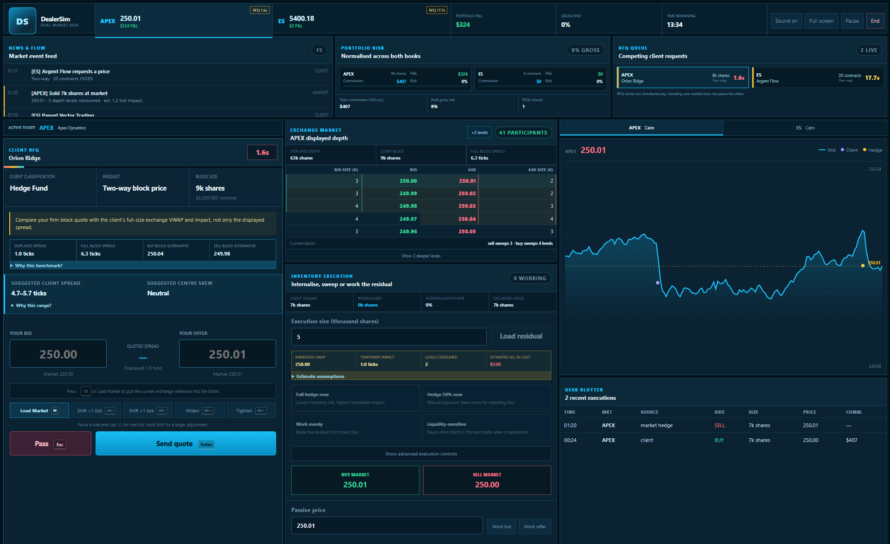
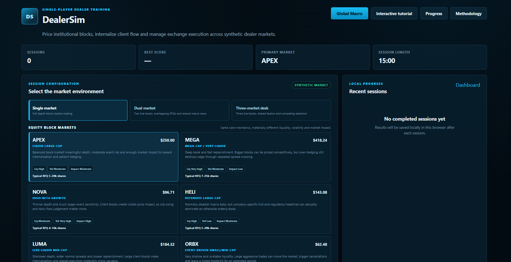
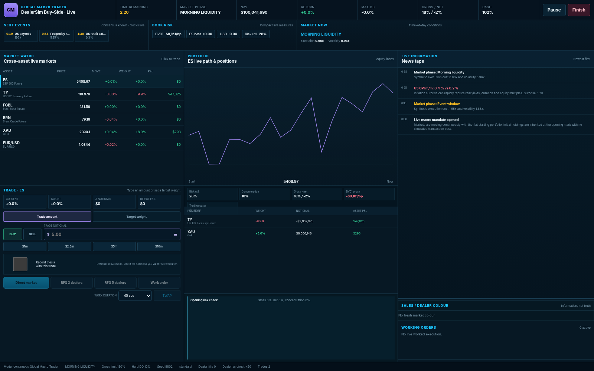
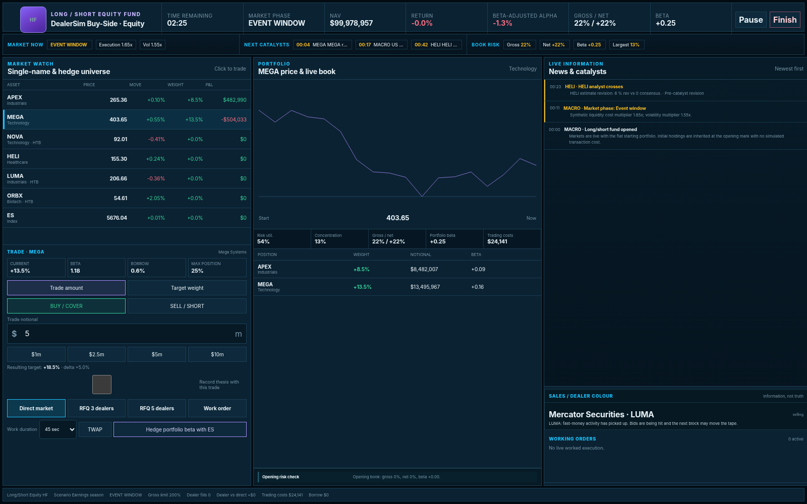

# DealerSim

**AI-assisted markets and portfolio simulation platform for practising sell-side market making, global macro, long/short equity and long-only asset management.**

DealerSim is a standalone, single-player browser application built around one idea: market views, execution, liquidity and risk should interact. The simulator therefore focuses on decisions such as pricing client blocks, managing inventory, sourcing dealer liquidity, working orders, reacting to macro and company catalysts, constructing portfolios and controlling factor exposure under changing synthetic market conditions.

DealerSim is an independent educational project. It does **not** connect to live markets or reproduce any institution's proprietary pricing, execution or risk systems.



## What it includes

### Sell-Side Dealer

A real-time dealer / flow-trading simulation in which the user:

- receives institutional-style client RFQs;
- makes two-way or directional block prices;
- compares the client quote with full-block executable market alternatives rather than only top-of-book spread;
- manages inventory, internalises offsetting client flow and hedges residual risk through exchange/worked execution or finite-capacity interdealer blocks;
- chooses between immediate market execution, passive orders and worked hedging;
- trades single-, dual- and three-market desks across synthetic equities and macro futures;
- operates through normal, fast, illiquid, toxic-flow and news-driven regimes;
- receives post-session P&L attribution, replay and skill diagnostics.

The dealer engine includes endogenous liquidity depletion, size-dependent market impact, temporary spread widening, book imbalance, reserve/iceberg liquidity, cancellation dynamics and instrument-specific replenishment.



### Global Macro

DealerSim contains two macro workflows:

- **Global Macro Trader** — continuous cross-asset trading in ES, US Treasuries, Euro-Bund, Brent, gold and EUR/USD.
- **Strategic Portfolio Manager** — a slower event-to-event 30-day mandate focused on allocation, thesis discipline and portfolio risk.

The live macro mode includes:

- visible consensus expectations and automatic macro releases;
- cross-asset factor transmission across growth, inflation, policy, risk, energy and USD;
- exact notional or target-weight sizing;
- direct market, dealer RFQ and worked execution routes;
- compact gross/net, concentration and factor-risk monitoring while trading;
- morning briefing and opening-book construction before the live clock begins;
- full stress, factor, attribution and decision review after the live session.



### Long / Short Equity Hedge Fund

A continuous $100m synthetic long/short book with:

- long and short single-name positions;
- securities-borrow locates, hard-to-borrow constraints and borrow costs;
- live portfolio beta, sector and style-factor exposure;
- ES index hedging;
- company earnings, guidance, analyst revisions, regulatory events and other catalysts;
- valuation, revisions, momentum, short interest, crowding and other pre-market research signals;
- dealer RFQs, direct market execution, worked orders and auction execution;
- alpha-versus-beta P&L attribution and thesis review.



### Long-Only Asset Management

A benchmark-relative active equity mandate using the same company and execution environment, but with long-only constraints and scoring focused on:

- benchmark-relative alpha;
- active weights and concentration;
- factor tilts;
- drawdown and risk control;
- turnover and transaction costs;
- catalyst interpretation and execution quality.

## Morning briefing and opening books

Continuous buy-side sessions start in a frozen pre-market stage. The user can review information before prices begin moving and either inherit a model/benchmark portfolio or build a custom opening book.

Equity morning packs can include:

- previous close and pre-market indication;
- forward valuation;
- earnings revisions and consensus growth;
- prior momentum and beta-relative performance;
- short interest, crowding and indicative borrow cost;
- overnight headlines;
- known catalyst timing.

Opening positions are treated as inherited holdings, so constructing the starting portfolio does not create artificial turnover or transaction costs.

## Execution and market microstructure

DealerSim deliberately separates **displayed market spread** from the cost of executing a large block.

For a block order, the engine can:

1. sweep the requested size through displayed depth;
2. estimate full-size VWAP;
3. apply temporary size/participation-dependent market impact;
4. compare dealer liquidity with the client's or fund's direct-market alternative;
5. allow residual risk to be internalised, crossed immediately or worked over time.

Liquidity changes through the simulated day and can deteriorate around events. Aggressive execution can consume depth, alter book imbalance, widen spreads and affect subsequent hedge costs. Rapid same-direction child orders accumulate synthetic information leakage, so repeatedly clicking a minimum clip is not a free substitute for block execution. Deep instruments replenish faster than less-liquid names.

Buy-side execution is quantity-first: equities trade in shares, futures in contracts and FX in lots, with notional calculated automatically. Live terminals show an executable synthetic bid/offer before the user chooses direct market, multi-dealer RFQ, partial/custom dealer fills, TWAP, liquidity-sensitive worked orders or equity auction routes. Direct/worked/auction routes charge explicit synthetic commission; dealer-RFQ economics are embedded in the quoted spread rather than double-charged.

## Progress Centre

Completed sessions are stored locally in the browser and feed a cross-mode training dashboard with:

- rolling 5- and 10-session averages;
- all-time and best scores;
- difficulty-adjusted performance;
- skill-component trends;
- scenario/regime diagnostics;
- persistent client and dealer relationship statistics;
- training milestones;
- recommended next drills based on weak areas;
- CSV and Markdown training-report export.

Session history and relationship data remain on the user's device. No account or backend is required.

## Calibration and validation

A simulation can look realistic while rewarding unrealistic behaviour. DealerSim therefore includes a deterministic strategy-testing layer designed to identify obvious exploits and poor incentive calibration.

The standard calibration run executes **384 seeded sessions** across deliberately simple dealer and portfolio policies, including examples such as:

- tight quoting while warehousing inventory;
- immediate hedging;
- defensive quoting and partial hedging;
- passive/internalisation-focused dealer behaviour;
- all-cash buy-side portfolios;
- concentrated long-only portfolios;
- beta-heavy long/short books.

The calibration process is used to identify behaviours that score well for the wrong reason and to adjust execution costs, market impact, risk constraints and scoring logic. It is a regression tool for internal consistency, not evidence that the synthetic market reproduces real institutional outcomes.

Run the calibration suite with:

```bash
npm run calibrate
```

The deterministic engine verification is available through:

```bash
npm run verify:engine
```

or on Windows:

```text
VERIFY_DEALERSIM.bat
```

More detail is available in:

- [`docs/CALIBRATION_REPORT.md`](docs/CALIBRATION_REPORT.md)
- [`docs/CALIBRATION_LAB.md`](docs/CALIBRATION_LAB.md)
- [`docs/SIMULATION_QUALITY.md`](docs/SIMULATION_QUALITY.md)

## AI-assisted development

DealerSim was developed using **AI coding agents as the implementation layer**.

I defined the product direction, market workflows, economic assumptions, simulation mechanics, test cases and calibration objectives, then directed and iterated the agent-generated implementation. Development involved repeatedly testing whether the resulting behaviour made economic sense and revising specifications when mechanics were unrealistic, exploitable or inconsistent.

The project is therefore intended to demonstrate **AI-assisted product development combined with independent market reasoning, specification and validation**. It should not be interpreted as a claim that the React/TypeScript codebase was written manually without AI assistance.

## Technology

- **Front end:** React + TypeScript
- **Build tooling:** Vite
- **Simulation architecture:** deterministic seeded TypeScript engines
- **Persistence:** browser `localStorage`
- **Testing:** deterministic engine verification, Vitest coverage and scripted calibration policies
- **Development workflow:** AI coding agents + Git/GitHub

The application has no backend and no live-market dependency.

## Running locally

### Requirements

- Node.js **20.19+**
- npm
- Desktop/laptop browser

### Install

```bash
git clone https://github.com/GusG5/DealerSim.git
cd DealerSim
npm install
```

### Start development server

```bash
npm run dev
```

Vite will print the local address, normally:

```text
http://localhost:5173
```

On Windows, `START_DEALERSIM.bat` can also be used after dependencies are installed.

### Verify

```bash
npm run build
npm run verify:engine
npm run calibrate
```

`VERIFY_DEALERSIM.bat` runs the main verification workflow on Windows.

## Storage compatibility

DealerSim v3.6.2 includes explicit local-storage schema versioning and a 60-second calibration-test timeout so the 384-session suite can complete on normal local hardware. If a browser contains progress/history from an incompatible older build, DealerSim safely resets the incompatible simulation history rather than allowing stale data to crash the application. User preferences are retained where possible, and the UI displays a one-time recovery notice.

This was added after reproducing a blank-screen failure caused by legacy browser data on `localhost` while a clean origin loaded correctly.

## Repository structure

```text
DealerSim/
├── src/
│   ├── components/       # Trading terminals, setup, tutorials and review UI
│   ├── engine/           # Dealer, macro and equity-fund simulation engines
│   ├── hooks/            # React controllers around simulation state
│   └── lib/              # Storage, formatting, audio and download helpers
├── scripts/              # Engine verification and calibration suite
├── docs/                 # Methodology, calibration and release documentation
├── public/
├── README.md
└── package.json
```

## Selected methodology notes

- [`docs/METHODOLOGY.md`](docs/METHODOLOGY.md) — dealer market-making mechanics
- [`docs/BUY_SIDE_METHODOLOGY.md`](docs/BUY_SIDE_METHODOLOGY.md) — macro portfolio engine
- [`docs/EQUITY_FUND_METHODOLOGY.md`](docs/EQUITY_FUND_METHODOLOGY.md) — long/short and long-only engine
- [`docs/PREMARKET_WORKFLOW.md`](docs/PREMARKET_WORKFLOW.md) — morning briefing and inherited opening books
- [`docs/DESK_REALISM_AND_ASSESSMENT.md`](docs/DESK_REALISM_AND_ASSESSMENT.md) — time-of-day, risk and assessment logic
- [`docs/PROGRESS_CENTRE.md`](docs/PROGRESS_CENTRE.md) — training analytics
- [`docs/ARCHITECTURE.md`](docs/ARCHITECTURE.md) — application structure
- [`docs/PUBLIC_RELEASE_CHECKLIST.md`](docs/PUBLIC_RELEASE_CHECKLIST.md) — GitHub publication checklist

## Limitations

DealerSim is an educational synthetic simulation, not an execution, pricing or portfolio-management system calibrated to proprietary institutional data.

In particular:

- displayed depth, market impact and liquidity-replenishment parameters are synthetic;
- fictional clients and dealers use simplified behavioural rules;
- event responses model plausible relationships rather than forecasting real markets;
- venue fragmentation, latency, regulatory constraints and many product-specific details are simplified;
- risk metrics are training abstractions rather than production risk models;
- calibration tests internal incentives and consistency, not external empirical accuracy.

The purpose is to practise market reasoning and decision-making under a coherent set of simulated constraints, not to predict live execution outcomes.

## Disclaimer

DealerSim is an independent educational project. It is not affiliated with Goldman Sachs, AmplifyME, IG Group, any exchange, broker, asset manager, hedge fund or other financial institution. All instruments, clients, dealers, prices and scenarios in the simulator are synthetic, and the application contains no proprietary or confidential institutional information.
